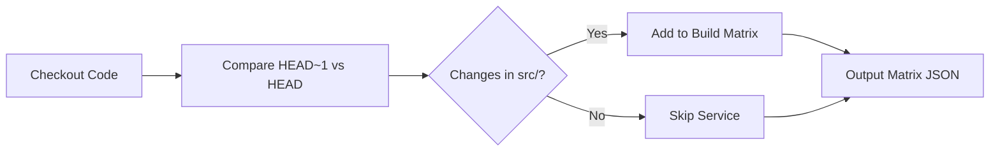
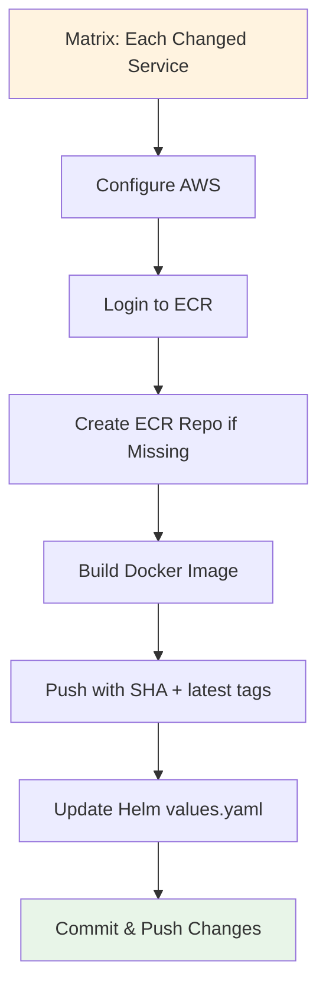
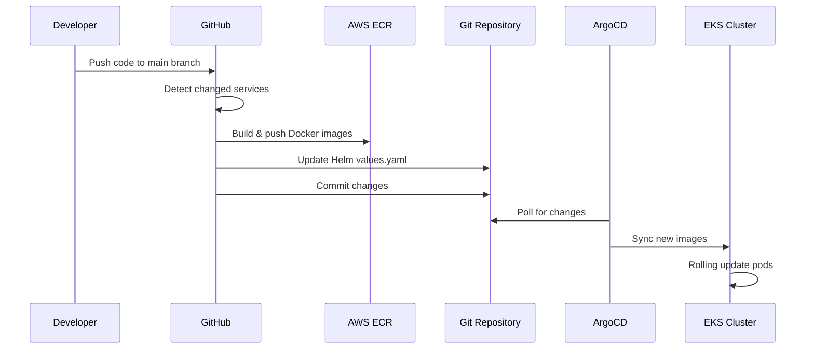
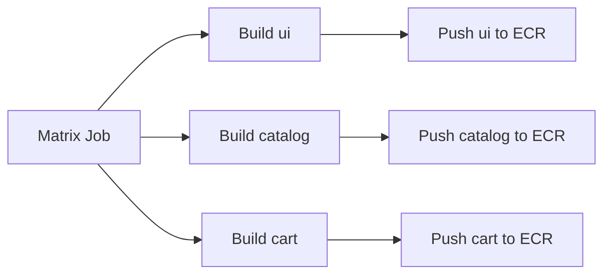
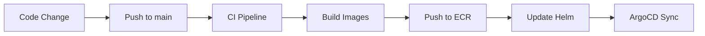

# GitHub Actions CI/CD Workflows

This directory contains the complete CI/CD pipeline for Retail Store following DevOps best practices.

## 🚀 Workflows Overview

### 1. **deploy.yml** - Main CI/CD Pipeline
**Triggers:** Push to main branch, Manual dispatch
**Purpose:** Automated build, test, and deployment

**Stages:**
```
┌─────────────┐    ┌─────────────┐    ┌─────────────┐    ┌─────────────┐
│   DETECT    │───▶│BUILD & PUSH │───▶│UPDATE HELM  │───▶│   ARGOCD    │
│   CHANGES   │    │   TO ECR    │    │   VALUES    │    │    SYNC     │
└─────────────┘    └─────────────┘    └─────────────┘    └─────────────┘
```

**DevOps Practices:**
- ✅ **Path-based triggers** - Only build changed services
- ✅ **Matrix builds** - Parallel service builds
- ✅ **Immutable tags** - Git SHA tags
- ✅ **GitOps integration** - Auto Helm value updates
- ✅ **Zero-downtime deployment** - Rolling updates


## Workflows

### `deploy.yml` - Main Deployment Pipeline

**Purpose**: Automated GitOps deployment pipeline that builds, pushes, and updates services when code changes.

**Triggers**:
- Push to `main` branch with changes in `src/**`
- Manual workflow dispatch (builds all services)

**Process Flow**:
```
Code Change → Detect Changes → Build & Push to ECR → Update Helm Values → Commit Changes → ArgoCD Sync
```

## Jobs Overview

### 1. **detect-changes**


- Analyzes git diff to identify changed services
- Creates build matrix for only modified services
- Supports services: `ui`, `catalog`, `cart`, `checkout`, `orders`

### 2. **deploy** (Matrix Job)


- Runs in parallel for each changed service
- **Docker Build**: Creates images with commit SHA tags
- **ECR Push**: Pushes to AWS ECR with auto-repository creation
- **Helm Update**: Updates `values.yaml` with new image tags
- **Git Commit**: Commits Helm changes back to repository

### 3. **summary**
- Creates deployment summary with status and actions
- Shows which services were deployed successfully

## GitOps Flow Diagram



## Required Secrets

Configure these in your GitHub repository settings:

| Secret | Description | Example |
|--------|-------------|---------|
| `AWS_ACCESS_KEY_ID` | AWS access key | `AKIA...` |
| `AWS_SECRET_ACCESS_KEY` | AWS secret key | `wJalr...` |
| `AWS_REGION` | AWS region | `us-east-1` |
| `AWS_ACCOUNT_ID` | AWS account ID | `123456789012` |

## Features

- **Smart Change Detection**: Only builds modified services
- **Parallel Deployment**: Services deploy simultaneously
- **ECR Auto-Creation**: Creates repositories automatically
- **Safe Helm Updates**: Preserves infrastructure component images
- **Retry Logic**: Handles git push conflicts
- **Rich Logging**: Detailed status with emojis

## Usage

### Automatic Deployment
1. Make changes to any service in `src/`
2. Push to `main` branch
3. Workflow automatically detects changes and deploys

### Manual Deployment
1. Go to Actions tab in GitHub
2. Select "Deploy" workflow
3. Click "Run workflow" → "Run workflow"
4. All services will be built and deployed

## Service Build Matrix Example

```json
{
  "service": ["ui", "catalog", "cart"]
}
```

When changes are detected in multiple services, the workflow creates a matrix job that builds each service in parallel:



## Troubleshooting

### Common Issues

**ECR Permission Denied**:
- Verify AWS credentials have ECR permissions
- Check AWS_ACCOUNT_ID is correct

**Helm Update Failed**:
- Ensure `values.yaml` exists in `src/{service}/chart/`
- Check file has proper `image:` section

**Git Push Failed**:
- Workflow includes retry logic for conflicts
- Check repository permissions for the GitHub token

**No Changes Detected**:
- Verify changes are in `src/**` paths
- Check git history with `git log --oneline`

## Workflow Customization

### Adding New Services
1. Add service name to `SERVICES` array in `detect-changes` job
2. Ensure service has `src/{service}/chart/values.yaml`
3. Test with manual workflow dispatch

### Changing Trigger Branch
```yaml
on:
  push:
    branches: [your-branch]  # Change from 'main'
```

### Custom ECR Repository Names
Modify the `ECR_REPO` variable in the build step:
```bash
ECR_REPO="${AWS_ACCOUNT_ID}.dkr.ecr.${{ env.AWS_REGION }}.amazonaws.com/your-custom-name-${SERVICE}"
```

## Integration with ArgoCD

This workflow follows GitOps principles:
1. Code changes trigger builds
2. New images are pushed to ECR
3. Helm values are updated with new image tags
4. Changes are committed back to repository
5. ArgoCD detects changes and syncs to cluster

The workflow ensures your Kubernetes cluster stays in sync with your code changes automatically.

## 🔧 Setup Requirements

### GitHub Secrets
Configure these secrets in your repository:

| Secret | Description | Example |
|--------|-------------|---------||
| `AWS_ACCESS_KEY_ID` | AWS Access Key | `AKIA...` |
| `AWS_SECRET_ACCESS_KEY` | AWS Secret Key | `wJalrXUt...` |
| `AWS_ACCOUNT_ID` | AWS Account ID | `123456789012` |

## 📊 DevOps Metrics Tracked

### DORA Metrics
- **Deployment Frequency**: Every push to main branch
- **Lead Time**: Code commit to deployment
- **MTTR**: Automated rollback capabilities
- **Change Failure Rate**: Tracked via deployment success/failure

### Quality Gates
- **Image Verification**: ECR image existence check
- **Health Checks**: Post-deployment validation
- **Matrix Builds**: Parallel service deployment

## 🔄 Workflow Execution Flow

### Development Workflow


## 🛠️ Customization Guide

### Adding New Services
1. **Add to SERVICES array in detect-changes job:**
   ```bash
   SERVICES=("ui" "catalog" "cart" "checkout" "orders" "new-service")
   ```

2. **Ensure Helm chart exists:**
   ```
   src/new-service/chart/values.yaml
   ```

3. **Test with manual dispatch**

### Modifying ECR Repository Names
```bash
# Update ECR_REPO variable
ECR_REPO="${AWS_ACCOUNT_ID}.dkr.ecr.${{ env.AWS_REGION }}.amazonaws.com/custom-name-${SERVICE}"
```

## 🔍 Monitoring & Observability

### Pipeline Monitoring
- **GitHub Actions logs** - Detailed execution logs
- **Matrix job status** - Parallel build tracking
- **ArgoCD UI** - Deployment status and health
- **ECR Console** - Image repository status

## 🚨 Troubleshooting

### Debug Commands
```bash
# Check workflow status
gh run list --workflow=deploy.yml

# View specific run logs
gh run view <run-id> --log

# Re-run failed jobs
gh run rerun <run-id> --failed
```

## 📈 Performance Optimization

### Build Optimization
- **Docker layer caching** - Reuse unchanged layers
- **Multi-stage builds** - Reduce final image size
- **Parallel builds** - Matrix strategy for services
- **Conditional builds** - Path-based triggers

### Deployment Optimization
- **Rolling updates** - Zero-downtime deployments
- **Resource limits** - Prevent resource exhaustion
- **Health checks** - Fast failure detection

## 🔐 Security Best Practices

### Implemented Security Measures
- ✅ **AWS IAM roles** - Secure credential management
- ✅ **Least privilege** - Minimal required permissions
- ✅ **Secret management** - GitHub Secrets integration
- ✅ **Image tagging** - Immutable SHA-based tags

---

**🎯 This pipeline follows industry best practices for:**
- Continuous Integration/Continuous Deployment
- Infrastructure as Code
- GitOps methodology
- Observability and monitoring
- Automated rollback capabilities